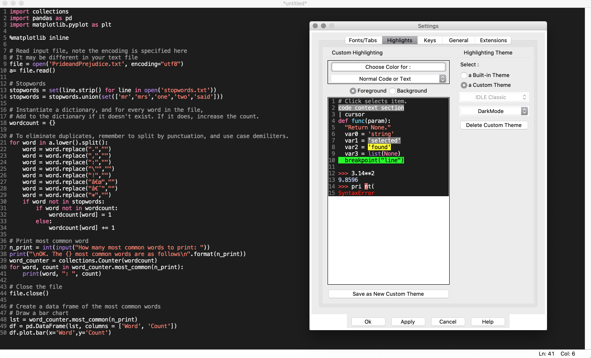

# IDLE color theme

My theme for Python IDLE fits for Mac OS X Dark mode.
It picked up from colors of Dark Mode and Xcode.

To install:
- copy files from `/theme` into `~/.idlerc` directory
- restart IDLE
- set custom theme in IDLE Preferences

